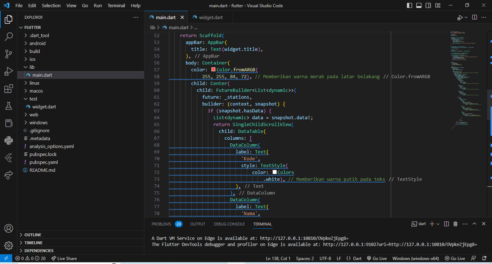
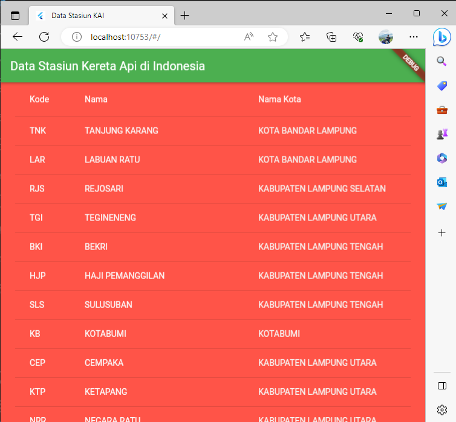

# aplikasi_data_stasiun_KAI_API
Membuat tampilan API dengan flutter

## Tugas Akhir Semester

### Nama        : Febri Aditiya
### Mata Kuliah : Pemrograman Mobile

#### Link Api
* https://booking.kai.id/api/stations2

#### Tampilan Aplikasi

